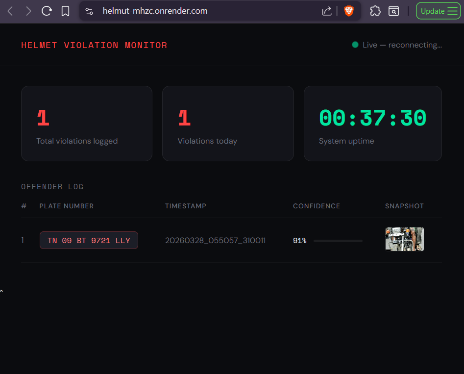
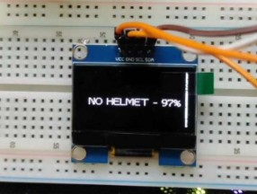
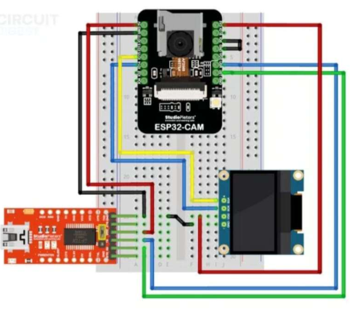

# Helmet Violation Detection System

> Autonomous helmet enforcement — ESP32-CAM runs Edge Impulse AI at the edge, flags violations, extracts number plates via OCR, and logs every offender to a live web dashboard. No manual intervention. Just power and Wi-Fi.

**Live Dashboard:** [helmut-mhzc.onrender.com](https://helmut-mhzc.onrender.com)

---

## Screenshots

### Live Dashboard — Offender Log


### OLED Output on Violation


### Cicuit Diagram


---

## System Architecture

```
┌─────────────────────────────────────────────────────────────────────┐
│                        ESP32-CAM (Edge)                             │
│                                                                     │
│  Boot → WiFiManager portal → Connect Wi-Fi                         │
│                  │                                                  │
│          Every 2 seconds:                                           │
│          1. Capture QVGA RGB888 frame                               │
│          2. Run Edge Impulse model → helmet/no-helmet score         │
│          3. Score ≥ 0.75 → VIOLATION                                │
│          4. Recapture VGA JPEG → POST to server                     │
│          5. Display result + plate on SSD1306 OLED                  │
└──────────────────────────┬──────────────────────────────────────────┘
                           │  HTTP POST /violation
                           │  multipart: plate_crop (JPEG) + confidence
                           ▼
┌─────────────────────────────────────────────────────────────────────┐
│                   Flask Server (Render.com)                         │
│                                                                     │
│  1. Receive JPEG + confidence                                       │
│  2. Save snapshot to static/snapshots/                              │
│  3. POST to OCR.space API → extract plate text                      │
│  4. Regex match Indian plate format (e.g. MH12AB1234)              │
│  5. INSERT into SQLite offenders table                              │
│  6. Push SSE event to all open dashboard browsers                   │
│  7. Return {"plate": "MH12AB1234"} to ESP32                        │
└──────────────────────────┬──────────────────────────────────────────┘
                           │  SSE push
                           ▼
┌─────────────────────────────────────────────────────────────────────┐
│                  Live Dashboard (Any Browser)                       │
│                                                                     │
│  New row appears instantly — no page refresh                        │
│  Plate number │ Timestamp │ Confidence │ Snapshot thumbnail         │
│  Total count + today count + uptime                                 │
└─────────────────────────────────────────────────────────────────────┘
```

---

## Hardware

| Component | Model / Spec | Role | Cost |
|---|---|---|---|
| Microcontroller + Camera | ESP32-CAM (AI-Thinker, OV2640) | Edge AI inference + image capture | ₹450 |
| OLED Display | 1.3" SSD1306, I2C | Live result display | ₹200 |
| FTDI Programmer | CH340 / CP2102 | Flash ESP32-CAM | ₹250 |
| Breadboard + Jumpers | Half-size + DuPont cables | Prototyping | ₹150 |
| Power Supply | 5V / 2A USB adapter | Stable power for CAM | ₹280 |
| **Total** | | | **₹1,330** |

### Wiring

```
OLED SCL  →  ESP32-CAM IO15
OLED SDA  →  ESP32-CAM IO14
OLED VCC  →  3.3V
OLED GND  →  GND
```

---

## Project Structure

```
helmut/
├── esp32/
│   └── helmet_violation/
│       ├── helmet_violation.ino             # Main Arduino sketch
│       └── sxmnath-project-1_inferencing.h  # Edge Impulse model header
│
├── server/
│   ├── app.py                          # Flask backend — receives violations, serves dashboard
│   ├── ocr.py                          # OCR.space API wrapper + plate regex parser
│   ├── database.py                     # SQLite init, insert, query
│   ├── requirements.txt
│   ├── .python-version                 # Pins Python 3.11.9 for Render
│   └── templates/
│       └── dashboard.html              # Live SSE dashboard
│
├── simulator/
│   └── simulate_esp32.py               # Send test images to server without hardware
│
├── test_images/                        # Drop motorbike/plate images here for testing
├── render.yaml                         # Render deployment config
├── .gitignore
└── README.md
```

---

## How It Works

### On the ESP32-CAM

**First boot** — creates a Wi-Fi hotspot called `HelmetMonitor-Setup`. Connect your phone to it, enter your Wi-Fi credentials in the captive portal. Credentials are saved to flash — every reboot after connects automatically without any intervention.

**Detection loop** — every 2 seconds, captures a QVGA frame in RGB888 format and feeds it to the Edge Impulse model via `run_classifier()`. The model returns confidence scores for `with_helmet` and `without_helmet`.

**Violation** — if `without_helmet` score ≥ 0.75, the camera switches to JPEG mode, captures a VGA frame, and HTTP POSTs it to the Flask server as a multipart form upload along with the confidence score.

**OLED** — shows `HELMET OK` with confidence, or `VIOLATION! Plate: XXXXXX` when a violation is confirmed. The plate number is returned by the server after OCR.

### On the Server

Receives the JPEG and saves it as a timestamped snapshot. Sends the image to OCR.space (free, 25k calls/month, no card needed). Parses the returned text with a regex for Indian plate format (`MH12AB1234`). Writes the record to SQLite. Pushes a Server-Sent Event to every open browser — the dashboard row appears instantly without any page refresh.

---

## Running Locally

### 1. Install dependencies

```bash
cd server
pip install -r requirements.txt
```

### 2. Set your OCR.space API key

Create `server/.env`:
```
OCR_SPACE_API_KEY=K8xxxxxxxxxxxxxxx
```
Get a free key (no card) at [ocr.space/ocrapi](https://ocr.space/ocrapi).

### 3. Start Flask

```bash
# Mac/Linux
export OCR_SPACE_API_KEY=K8xxxxxxxxxxxxxxx
python app.py

# Windows PowerShell
$env:OCR_SPACE_API_KEY="K8xxxxxxxxxxxxxxx"
python app.py
```

Open `http://localhost:5000` — dark dashboard, zero violations.

### 4. Run the simulator (no hardware needed)

```bash
cd simulator
python simulate_esp32.py --image ../test_images/no_helmet_with_plate.jpg
```

Loop mode — cycles through all images in `test_images/` every 5 seconds:
```bash
python simulate_esp32.py --loop --delay 5
python simulate_esp32.py --loop --random --delay 3
```

Expected output:
```
[OK]  no_helmet_with_plate.jpg    plate=MH12AB1234  ts=20260328_154322_001
```

Dashboard at `http://localhost:5000` updates live — new row appears without any page refresh.

### 5. Flash the ESP32

Open `esp32/helmet_violation/helmet_violation.ino` in Arduino IDE. Install the Edge Impulse library by adding the `.zip` exported from your Edge Impulse project. Install `WiFiManager` by tzapu via Library Manager.

Board settings:

| Setting | Value |
|---|---|
| Board | AI Thinker ESP32-CAM |
| Partition Scheme | Huge APP (3MB No OTA) |
| CPU Frequency | 240MHz |
| Upload Speed | 115200 |

Update `SERVER_URL` in the sketch to your Render URL, upload, open Serial Monitor at 115200 baud.

On first boot the ESP32 creates a hotspot called `HelmetMonitor-Setup` — connect your phone to it, enter Wi-Fi credentials, and it connects and starts detecting automatically.

---

## Deployment (Render)

`render.yaml` at the repo root handles the full deployment config. Steps:

1. Go to [render.com](https://render.com) → New → Web Service → connect this repo
2. Render auto-detects `render.yaml` — confirm Root Directory is `server`
3. Add one environment variable: `OCR_SPACE_API_KEY = K8xxxxxxxxxxxxxxx`
4. Click Deploy — build completes in ~2 minutes

No heavy ML dependencies on the server. OCR is a pure HTTP call to OCR.space, so the entire server stack is under 50MB.

---

## Tech Stack

| Layer | Technology |
|---|---|
| Firmware | C++ (Arduino framework, ESP32-CAM) |
| Edge AI model | Edge Impulse (TFLite Micro, exported as `.h` header) |
| Wi-Fi provisioning | WiFiManager by tzapu (captive portal, no hardcoded credentials) |
| Backend | Python, Flask |
| OCR | OCR.space API (free tier, 25k calls/month) |
| Database | SQLite |
| Live updates | Server-Sent Events (SSE) — zero polling, instant push |
| Frontend | HTML, CSS, Vanilla JS |
| Hosting | Render.com (free tier) |

---

## Known Limitations

**Ephemeral storage on Render free tier** — snapshots and the SQLite database reset on every redeploy. For persistent storage, swap SQLite for Render PostgreSQL (free tier available) and snapshots for Cloudinary.

**Render cold start** — free tier sleeps after 15 minutes of inactivity. The ESP32 sends a keepalive GET to `/health` every 10 minutes while powered on to prevent this.

**OCR accuracy** — depends on image quality and plate visibility. Works best when the camera is mounted at a fixed choke point (gate, speed bump) 2–3 metres high, angled so both rider and plate are in frame simultaneously.

**Two-frame capture** — helmet inference runs on an RGB frame; plate POST uses a separately captured JPEG frame. If the rider moves between the two captures (~200ms apart), the plate crop may be blurry or empty. A single-frame dual-crop approach would eliminate this — a future improvement.

---

## License

MIT
